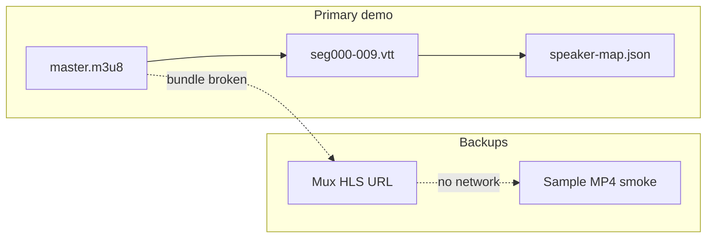

# Multi-speaker proposal: demo assets, backups, and task list

Date: 2026-05-09  
Status: Proposal (execution-ready checklist)  
Related: [ADR-0002 Multi-Speaker Caption Presentation](../ADR-0002-Multi-Speaker-Caption-Presentation.md) (architecture decision), [memlog/MultiSpeakerSupport3.md](../memlog/MultiSpeakerSupport3.md) (feasibility audit), [Docs/Fixture-Inventory.md](Fixture-Inventory.md)

This document captures **concrete tasks** for a recordable multi-speaker Caption Theater demo: named bundle paths, acceptance criteria, backup playback order, and explicit non-goals. Policy and prevalence rationale stay in the memlog audit.

---

## Demo success criteria (internal recordable demo, 2–3 minutes)

1. Playback uses **`bundledOfflineHLSMock`** with **no network**.
2. **Ultra-wide top-pinned** layout is visible (`1920×800` presentation + Caption Theater opt-in).
3. **At least 8–12 alternating lines** show **distinct** speaker labels in the lower band using **trusted** `fixtureAnnotated` data (sidecar or authored VTT), not inference.
4. If speaker attribution is off or files are missing, the demo still shows **wrapping / retention** (baseline band) with **no crash**.

---

## Assets that exist today (repo facts)

| Role | Location / URL | Video | Subtitles | Speaker metadata in file |
|------|------------------|-------|-----------|-------------------------|
| Primary offline | [`CaptionTheater/CaptionTheater/Media/OfflineHLS/TearsOfSteelFiveMinuteMock/master.m3u8`](../CaptionTheater/CaptionTheater/Media/OfflineHLS/TearsOfSteelFiveMinuteMock/master.m3u8) | `1920×800` HLS | [`subtitles/english.m3u8`](../CaptionTheater/CaptionTheater/Media/OfflineHLS/TearsOfSteelFiveMinuteMock/subtitles/english.m3u8) + [`subtitles/segments/seg000.vtt` … `seg009.vtt`](../CaptionTheater/CaptionTheater/Media/OfflineHLS/TearsOfSteelFiveMinuteMock/subtitles/segments) | **None** (plain dialogue; names occasionally inside text only). |
| Network fallback | `https://stream.mux.com/4XYzhPXzqArkFI8d1vDsScBLD69Gh1b2.m3u8` ([`CaptionTheaterPlaybackFixture`](../CaptionTheater/CaptionTheater/Playback/CaptionTheaterPlaybackFixture.swift)) | Mux Tears of Steel | Live sidecar subs | Treat like plain text unless verified; do not assume structured ids. |
| Synthetic MP4 | [`CaptionTheaterPlaybackFixture.sampleVideoURL`](../CaptionTheater/CaptionTheater/Playback/CaptionTheaterPlaybackFixture.swift) → bundled `CaptionTheaterSamplePlayback.mp4` | Letterboxed sample | Not the ultra-wide HLS + dialogue path | **Unsuitable** as primary speaker demo without new subtitle + wiring. |

**Gap:** There is no bundled asset with machine-stable per-cue speaker ids until **`speaker-map.json`** is added and reviewed, VTT is authored with explicit labels / `<v>` where permitted, or a **wholly owned** short clip is packaged.

---

## Backup chain (demo day order)

1. **Primary:** Offline mock — [`CaptionTheaterPlaybackFixture.offlineHLSMockMasterPlaylistURL(bundle:)`](../CaptionTheater/CaptionTheater/Playback/CaptionTheaterPlaybackFixture.swift); verify with [`CaptionTheaterOfflineHLSBundleTests`](../CaptionTheater/CaptionTheaterTests/CaptionTheaterOfflineHLSBundleTests.swift).
2. **Bundle broken:** Fix resources until offline tests pass.
3. **Policy blocks offline speaker PoC:** Use **`muxTearsOfSteelHLS`** for **layout-only** demo (network); do **not** claim speaker metadata without verified VTT + matching sidecar or parse proof.
4. **No network:** Use **`CaptionTheaterSamplePlayback.mp4`** only for **smoke** (transport/layout), not as the multi-speaker story.

---

## Task checklist (all actionable items)

Use these as issue/PR bullets; order matches recommended sequencing.

| ID | Task | Acceptance criteria |
|----|------|---------------------|
| **MS-01** | **Lock demo source** — Confirm canonical demo uses `CaptionTheaterPlaybackDemoSource.bundledOfflineHLSMock` and document launch flags ([`CaptionTheaterLaunchConfiguration`](../CaptionTheater/CaptionTheater/Playback/CaptionTheaterLaunchConfiguration.swift)). | Playback opens `master.m3u8` under `OfflineHLS/TearsOfSteelFiveMinuteMock/` with **no network**. |
| **MS-02** | **Author PoC `speaker-map.json`** — Place under `CaptionTheater/CaptionTheater/Media/OfflineHLS/TearsOfSteelFiveMinuteMock/speaker-map.json` (or agreed path). Use **`start` / `end` in seconds** aligned to cues in `seg000.vtt`–`seg009.vtt` (never cue index only). Cover at least **8–12** lines (e.g. ~23s–90s or full clip) with stable speaker ids (e.g. celia/thom). | JSON validates; every `speakerID` references `speakers[]`; windows overlap real VTT cue times. |
| **MS-03** | **Legal / governance note** — Add short PoC-only note for sidecar/annotation per [Fixture-Inventory](Fixture-Inventory.md) (e.g. `Docs/Sources.md` subsection or README beside mock). | Reviewer can sign off distribution vs PoC use. |
| **MS-04** | **Ingest sidecar + UI** — Load sidecar when present; join to scrolling cue model by **presentation time** ([`CaptionTheaterPlaybackShellViewModel`](../CaptionTheater/CaptionTheater/Playback/CaptionTheaterPlaybackShellViewModel.swift)); render **transcript rail** (chip + text) for `fixtureAnnotated` only. | Attributed lines show chip; non-attributed path unchanged. |
| **MS-05** | **Unit tests** — Decode `speaker-map.json`; reject invalid `speakerID`; assert time overlap against fixture VTT excerpts; keep **no future cue** / persistence behavior green. | Tests pass in CI; no weakened tests. |
| **MS-06** | **Demo runbook** — Add `Docs/MultiSpeaker-Demo-Runbook.md`: primary path, launch args, Mux URL fallback, MP4 smoke caveat, `xcodebuild test` command for bundle verification. | Anyone can run demo or backup without tribal knowledge. |
| **MS-07** | **Alternative path (optional)** — Only if MS-02 is blocked: owned **~30s** HLS+WebVTT **or** replaced segment with explicit `[SPEAKER]` / `<v>`; extend [`CaptionTheaterOfflineHLSBundleTests`](../CaptionTheater/CaptionTheaterTests/CaptionTheaterOfflineHLSBundleTests.swift). | Same demo success criteria offline. |

### Optional follow-ups (not required for first demo)

- SwiftUI snapshot tests for two-speaker rail layout (if snapshot harness is already standard).
- Spike: `AVPlayerItemLegibleOutput` + crafted `<v>` WebVTT to see if **platform** preserves voice in `NSAttributedString` (informs future Tier C); current legible path flattens with [`.string` only](../CaptionTheater/CaptionTheater/Playback/CaptionTheaterLegibleCaptionFormatting.swift).

---

## Explicitly out of scope (this proposal phase)

- Catalog-wide studies of `<v>` prevalence without a defined corpus and owner.
- TTML/IMSC `ttm:agent` parsing, audio diarization, spatial speaker anchoring.
- Product promise that retail streams expose stable per-cue speaker ids.

---

## Diagram: primary vs backups

---

## Next step

Execute tasks **MS-01** through **MS-06** in order; open **MS-07** only if the sidecar path is blocked after governance review.
